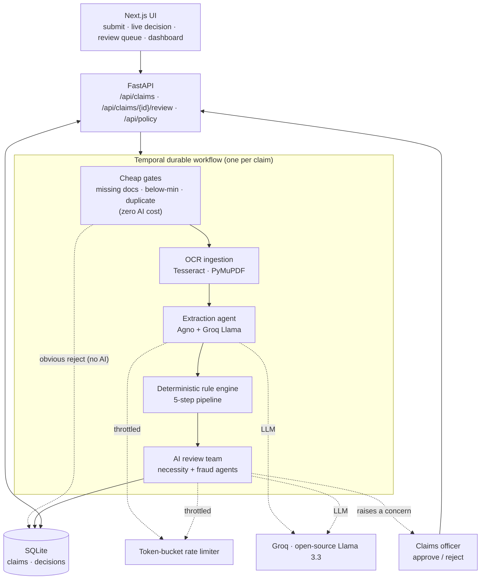
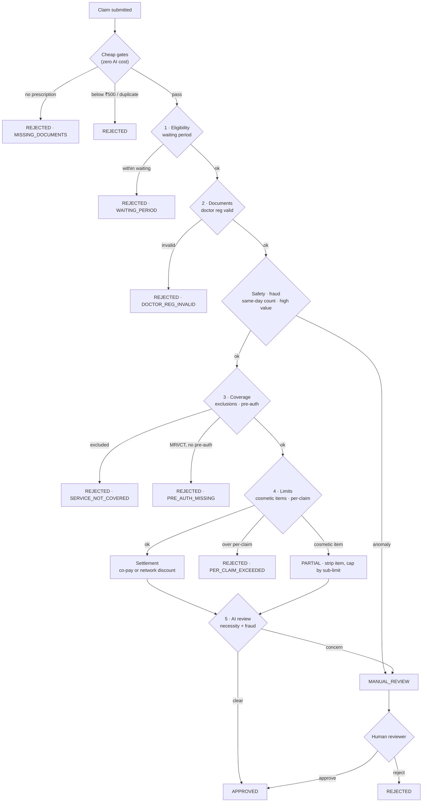

# Plum OPD — Claim Adjudication Tool

An AI-powered tool that decides OPD (outpatient) insurance claims automatically.
A member submits their bill and prescription; the system reads the documents,
checks them against the policy, and returns a clear decision — **approved,
rejected, partially approved, or sent to a human** — with the amount, the reason,
and a confidence score.

## Live demo

- **App:** _https://plum-opd-frontend.onrender.com_ ← paste your Render URL here
- **API docs:** _https://plum-opd-backend.onrender.com/docs_

> Hosted on Render's free tier, so the first request after idle may take ~50s to
> wake the service. See [Deploy your own](#deploy-your-own-render) below.

## The one idea behind everything

Insurance decisions have to be **accurate, repeatable, and explainable**. A
language model is brilliant at reading messy documents but is the wrong tool to
decide who gets paid — it can answer differently on the same input, and "the model
was confident" is not something you can defend to a regulator. So the work is
split three ways:

> **The AI reads and reasons about the fuzzy parts. A deterministic rule engine
> decides the money and the hard rules. A human resolves anything the AI is
> unsure about.**

Concretely:
- **AI (Llama, via Groq + Agno)** turns a photo of a prescription into structured
  data, and judges *clinical* questions like "does this diagnosis justify this
  treatment?" It can **flag and escalate** — it can never approve a claim or change
  an amount.
- **The rule engine (plain Python)** applies the policy exactly the same way every
  time. It passes all 10 provided test cases at 100%.
- **The human** has the final say on anything the AI escalates.

## What it does

- 📄 **Reads real documents** — upload an image or PDF; OCR + an LLM pull out the
  doctor, diagnosis, line items, and dates.
- ⚖️ **Adjudicates deterministically** — a 5-step policy pipeline (eligibility →
  documents → coverage → limits → medical necessity) with co-pay, network discount,
  and partial-approval math.
- 🧠 **AI review team** — two Agno agents (medical-necessity + fraud) catch
  clinically wrong claims the rules can't see, and escalate them to a human.
- 🙋 **Human-in-the-loop** — escalated claims land in a review queue where an
  officer approves or rejects them.
- 🔁 **Durable & cost-safe** — every claim runs as a Temporal workflow (retries,
  crash-safe), with cheap pre-checks and a rate limiter so the LLM budget is never
  blown.
- 📊 **Explainable** — every decision shows the exact rules it checked, plus an
  optional plain-English summary that **cites the real policy clauses** (RAG).
- 🛠️ **Admin & status** — an admin dashboard to edit policy limits/exclusions, and
  a `/api/status` endpoint reporting which capabilities (AI, OCR, Temporal) are live.

## Architecture



Full write-up: [docs/architecture.md](docs/architecture.md).

## How a decision is made

A claim flows top-to-bottom and stops at the **first** rule that decides it —
cheap checks first (to save cost), then the ordered policy rules, then the AI
review, then a human if needed.



Full write-up: [docs/decision-flow.md](docs/decision-flow.md).

## Tech stack

- **Frontend:** Next.js 16, React 19, TypeScript, Tailwind v4
- **Backend:** Python, FastAPI, SQLAlchemy + SQLite (Postgres-ready)
- **AI:** OpenAI (`gpt-4o-mini`) or Groq (open-source Llama 3.3) via the Agno agent framework — switchable by env
- **OCR:** Tesseract + PyMuPDF
- **Orchestration:** Temporal (durable workflows) + a token-bucket rate limiter
- **CI:** GitHub Actions (tests + typecheck + build)

## Getting started

### Run with Docker (one command)

The fastest way — builds and runs the backend + frontend together:

```powershell
# Put your Groq key in a .env file next to docker-compose.yml:
"GROQ_API_KEY=gsk_your_key_here" | Out-File -Encoding ascii .env
docker compose up --build
```

App at <http://localhost:3000>, API at <http://localhost:8000/docs>. This runs in
in-process mode; for the durable Temporal pipeline, see "Durable mode" below.

### Deploy your own (Render)

The repo ships a [`render.yaml`](render.yaml) blueprint that deploys **both**
services (backend + frontend) with one click — Render builds them from the same
Dockerfiles, so the cloud deployment includes Tesseract OCR too.

1. Push this repo to GitHub.
2. In Render: **New → Blueprint**, pick the repo, **Apply**.
3. When prompted, set two values: **`GROQ_API_KEY`** (your Groq key) and
   **`ADMIN_TOKEN`** (the password you'll use for the `/admin` page).

That's it. Render wires the frontend to the backend automatically, runs the
pipeline in-process (no Temporal server needed), and gives each service a public
URL. The database is ephemeral SQLite — fine for a demo; for persistence, add a
Render Postgres and set `DATABASE_URL`.

### Run locally (without Docker)

#### Prerequisites
- **Python 3.12** and **Node 20+** (required)
- An **LLM API key** for the AI features — either **OpenAI**
  (<https://platform.openai.com/api-keys>) or a free **Groq** key
  (<https://console.groq.com/keys>). Put whichever you have in `backend/.env`.
- *Optional:* **Tesseract OCR** (for image/PDF upload) and the **Temporal CLI**
  (for durable mode). The app runs fine without them — uploads need Tesseract;
  without Temporal it runs the same pipeline in-process.

### 1. Backend
```powershell
cd backend
python -m venv .venv
.\.venv\Scripts\Activate.ps1          # macOS/Linux: source .venv/bin/activate
pip install -e ".[dev]"
copy .env.example .env                # then put your GROQ_API_KEY in .env
.\.venv\Scripts\python.exe -m uvicorn app.main:app --reload
```
API at <http://localhost:8000>, interactive docs at <http://localhost:8000/docs>.

### 2. Frontend
```powershell
cd frontend
npm install
npm run dev
```
App at <http://localhost:3000>.

### 3. (Optional) Durable mode with Temporal

With Temporal running, every claim becomes a durable, retryable workflow you can
watch in the Temporal UI. Without it, the app automatically falls back to the
in-process path — same pipeline, just not crash-safe.

**In Docker (recommended — one command):**
```powershell
docker compose -f docker-compose.yml -f docker-compose.temporal.yml up --build
```
Brings up the app **plus** a Temporal server + a separate worker + the Temporal UI
(<http://localhost:8233>). Submit a claim and watch `AdjudicateClaimWorkflow` run.

**Locally (without Docker):**
```powershell
temporal server start-dev --ui-port 8233          # terminal 1 — Temporal UI at :8233
cd backend; .\.venv\Scripts\python.exe -m app.temporal.worker   # terminal 2 — the worker
```
Then run the backend with `TEMPORAL_ENABLED=true`.

### Configuration (`backend/.env`)
| Variable | Default | Purpose |
|----------|---------|---------|
| `LLM_PROVIDER` | auto | `openai` or `groq`. Auto-detects: OpenAI if its key is set, else Groq |
| `OPENAI_API_KEY` | — | Your OpenAI key (AI features) |
| `OPENAI_MODEL` | `gpt-4o-mini` | OpenAI model for extraction + review |
| `GROQ_API_KEY` | — | Your Groq key (alternative provider) |
| `GROQ_MODEL` | `llama-3.3-70b-versatile` | Groq model for extraction + review |
| `TEMPORAL_ENABLED` | `true` | Use Temporal when reachable (falls back if not) |
| `AI_REVIEW_ENABLED` | `true` | Run the AI review team on approvable claims |
| `TESSERACT_CMD` | auto-detected | Path to `tesseract.exe` if not on PATH |
| `DATABASE_URL` | `sqlite:///./claims.db` | Swap for Postgres in production |
| `ADMIN_TOKEN` | `admin` | Password required to edit the policy (`/admin`) — **set a real one in production** |

The **frontend** takes one env var, `BACKEND_URL` (default `http://127.0.0.1:8000`):
the Next.js server proxies `/api/*` to it at runtime, so the browser only ever
talks to its own origin — no CORS, and no backend URL baked into the build.

## Testing & accuracy

```powershell
cd backend
.\.venv\Scripts\python.exe -m pytest -q     # full suite (live LLM/OCR tests skip without a key)
.\.venv\Scripts\python.exe eval.py          # accuracy vs the 10 provided test cases
```
`eval.py` reports **100% decision accuracy and 100% amount accuracy** against
`test_cases.json`. The deterministic suite always runs; tests that need the LLM or
Tesseract skip cleanly when those aren't available.

## Admin dashboard

`/admin` lets an administrator view and edit the live policy (limits, sub-limits,
exclusions) without redeploying — backed by `GET`/`PUT /api/policy`. The page is
**password-protected**: it prompts for the `ADMIN_TOKEN` and verifies it against the
backend (`POST /api/admin/login`) before revealing the editor, and the policy-write
endpoint rejects any request without the correct token (`401`). Local default is
`admin`; set a real `ADMIN_TOKEN` in any deployment.

## API

Summary in [docs/api.md](docs/api.md); live interactive docs at `/docs`.

## Project structure

```
backend/
  app/
    engine.py        # deterministic rule engine (the 5-step pipeline)
    gates.py         # cheap pre-extraction checks
    extraction.py    # Agno + Groq document extraction
    review.py        # Agno AI review team (necessity + fraud) + advisory layer
    service.py       # orchestrates gate → engine → review → persist
    main.py          # FastAPI endpoints
    db.py / repository.py
    temporal/        # durable workflow, activities, worker, rate limiter
  tests/             # pytest (deterministic + live-skipping integration tests)
  eval.py            # accuracy harness
frontend/
  src/app/           # submit, claims, claim detail, review queue, admin
  src/components/    # decision card, confidence meter, review panel, ...
docs/                # architecture, decision flow, API
ASSUMPTIONS.md       # documented calls on ambiguous/contradictory rules
```

## Notes & limitations

- **Groq free tier** caps daily tokens. If the AI features pause, the daily quota
  is exhausted — switch `GROQ_MODEL` to a smaller model (e.g.
  `llama-3.1-8b-instant`, a separate quota), use a new key, or wait for reset. The
  deterministic engine and JSON submissions are unaffected.
- Confidence scores are computed directionally (high for clear deterministic
  outcomes, low for escalations) — they are honest signals, not calibrated
  probabilities.
- See [ASSUMPTIONS.md](ASSUMPTIONS.md) for interpretation calls on the provided
  rules and data.
