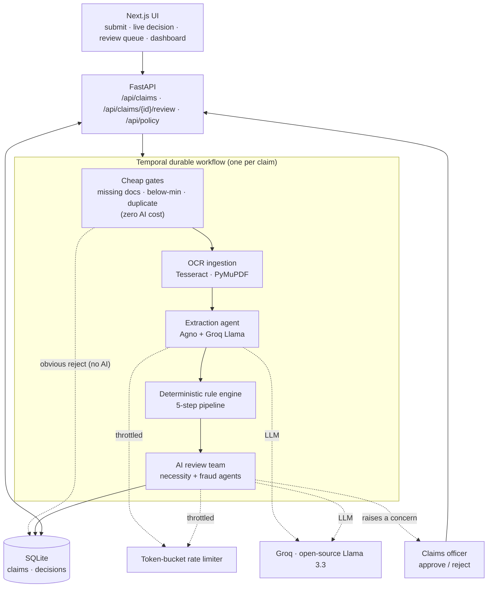

# Architecture

The system has one guiding idea: **AI reads and reasons about the fuzzy parts; a
deterministic engine decides the money and the hard rules; a human resolves
anything the AI is unsure about.** Each layer below maps to that idea.

## Layers

| Layer | Tech | Responsibility |
|-------|------|----------------|
| **UI** | Next.js 16, React 19, Tailwind v4 | Submit claims (upload or structured), watch the live decision, work the review queue, browse all claims |
| **API** | FastAPI | Thin gateway: validate, orchestrate, persist, serve status |
| **Orchestration** | Temporal | One durable workflow per claim; each step is a retryable activity. Survives crashes, retries an LLM hiccup in place |
| **Cheap gates** | Pure Python | Reject the obvious (missing prescription, below minimum, duplicate) **before** any OCR or LLM cost |
| **Ingestion** | Tesseract, PyMuPDF | Turn uploaded images/PDFs into raw text |
| **Extraction** | Agno + Groq (Llama 3.3) | Read the raw text into structured fields. Reads only — never decides |
| **Rule engine** | Pure Python | The 5-step deterministic pipeline. Decides the money and the hard rules. Fully auditable, 100% reproducible |
| **AI review team** | Agno *team* (necessity + fraud agents) | Judges clinical appropriateness; can escalate to a human, never approve or change amounts |
| **Rate limiter** | Token bucket + worker concurrency cap | Stops LLM overuse / 429s under load |
| **Knowledge (RAG)** | Lexical retriever over policy + rules clauses | Grounds the plain-English decision explanations in the real policy text (with citations) |
| **Storage** | SQLite (Postgres-ready) | Claims, extracted fields, decisions, human resolutions |

## Why AI never makes the final call

The deterministic engine is the source of truth because insurance decisions must
be **exact, reproducible, and auditable** — "the model was fairly confident" is
not a defensible reason to pay or deny a claim. The AI can only ever make the
system *more cautious* (escalate to a human); it can never invent an approval or
move a number. See the [decision flow](decision-flow.md) for exactly where each
actor decides.
