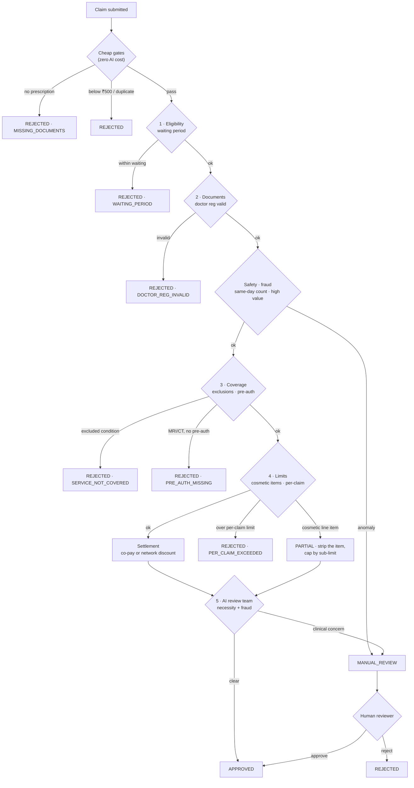

# Decision logic

A claim flows top-to-bottom and stops at the **first** rule that decides it. The
order matters: cheap checks first (to save cost), then the ordered policy rules,
then the AI review, then a human if needed. This mirrors `adjudication_rules.md`
and its conflict-priority ("safety first, exclusions over everything, hard limits
cannot be exceeded").

## Who decides what

- **Cheap gates** and the **rule engine** are pure, deterministic Python. Same
  input → same output, every time. This is what makes the 10 provided test cases
  pass at 100%.
- The **AI review team** only sees the *clinical* picture (diagnosis, treatment,
  medicines) — never the amounts — and can only **escalate** an otherwise-approved
  claim to a human. It cannot approve, reject, or change money on its own.
- The **human reviewer** has the final say on anything escalated, and that
  resolution is recorded against the claim.

See [ASSUMPTIONS.md](../ASSUMPTIONS.md) for the documented calls made where the
provided rules and sample data were ambiguous (e.g. the per-claim-limit conflict
between test cases TC002 and TC003).
